# glitchLoaf
You are an edge detector. So am I.

Our pattern recognition capacity is dominated by our ability to separate and extract "components" of sensory input. What lies between these components also defines them... This is a [fundamental principle in computer vision](https://courses.cs.washington.edu/courses/cse528/11sp/Olshausen-nature-paper.pdf) and core part of experiencing the world, especially through optical sensory.

## KillScreens
This is a collaboration with [SgtSlaughtermelon](https://twitter.com/sgt_sl8termelon)-- please check out their article on generating the Inaccessible Worlds source artworks [beautifully generated by hand](https://sgtslaughtermelon.com/art/inaccessible-worlds/) and consider [minting some of their art](https://async.market/blueprints/62e7ffc0f25798787770e75f/sgtslaughtermelon-inaccessible-worlds).
This is inspired by/ implemented as a simulation of bismuth crystal growth. Soon to be published via [GlitchForge](https://glitchforge.xyz).

<table align='center'>
<tr>
<td>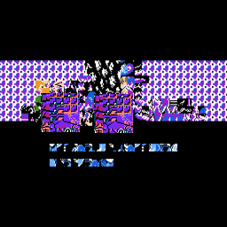</td>
<td>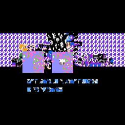</td>
</tr>
</table>
<table align='center'>
<tr>
<td>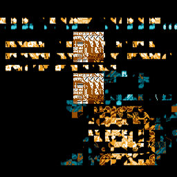</td>
<td>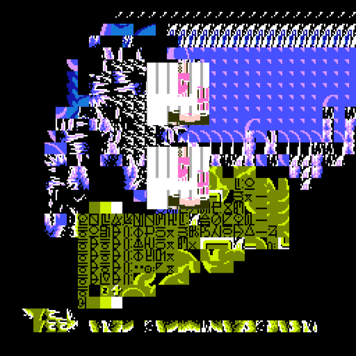</td>
</tr>
</table>

## NFT pfps
My original twitter earned a lifetime ban because I decided to start glitching the profile picture of everyone who interacted with my tweets. None of the source art here is my property, please check out:

### [BASED Ghouls](https://twitter.com/BASEDghouls)

<table align='center'>
<tr>
<td>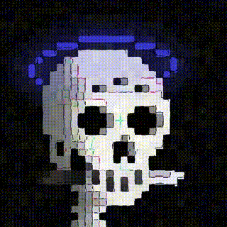</td>
<td>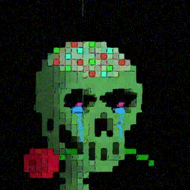</td>
<td>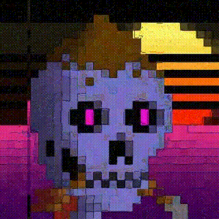</td>
<td>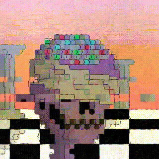</td>
</tr>
</table>
<table align='center'>
<tr>
<td>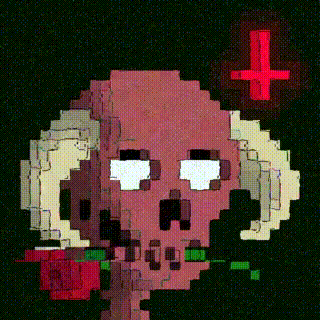</td>
<td>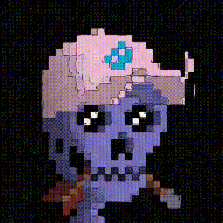</td>
<td>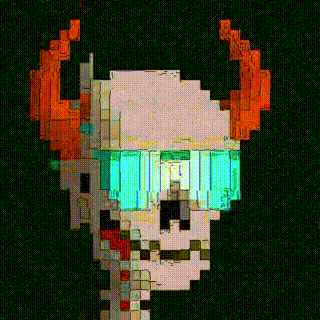</td>
<td>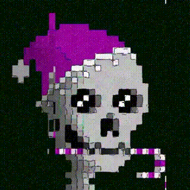</td>
</tr>
</table>
<table align='center'>
<tr>
<td></td>
<td>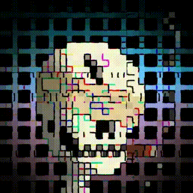</td>
<td>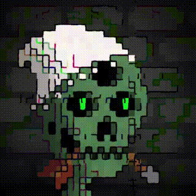</td>
<td>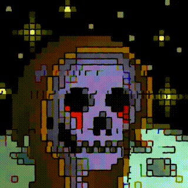</td>
</tr>
</table>


# How to use
- Ask me to make a real interface
- Wait for us to publish a working fork on [GlitchForge](https://glitchforge.xyz/)
- Run `DEMO.py` at your own risk...

### some details...
after pointing it toward the data you want:
```
filename = 'sun-img.jpg'
input_file  = r'imgs\{}'.format(filename)
output_path = r'results\{}'.format(filename.split('.')[0])
```
You can just set `input_file` and `output_file` to be exactly where to load the input and save the output. Dependencies:
```
imageio, PIL, numpy, matplotlib, skimage, scipy
```

The top `DEMO.py` hosts all the configuration parameters where you put most of your settings (except order of operations, you have to shift the method calls around in the bottom of the file).
Here are the options:
### Frame Selection
`frameSel = {'beg':0, 'stepsize':1, 'end': 20}`. For a single image output, set the `end` value to 0. IF your input is a video, then the frames `beg:stepsize:end` will each be glitched then animated into a gif. Set `end` to -1 to go to the final frame automatically. If the input is a single image, that image will be re-used over and over (but the glitches will change each "frame", resulting in an animation).
### What is a Glitch?
In this context, a glitch is when you take a block of pixels out of an image and circularly shift it around the image. A random group of rows or columns are selected, and shifted, while holding the rest of the image unaltered.

The _intensity_ of the glitch is how far it's shifted (for example, glitch intensity of 0.01 only allows blocks of pixels to be shifted by 1% of the image size). The _size_ of the glitch is how wide the block of pixels is allowed to be (for example, a size of 0.25 would grab a block 1/4 of the image's size). The _number_ of glitches is how many of these operations are applied per frame.

The main glitch parameters go into a dictionary with this name:
```
gtSpec = {'int-style':'updown-exp',
         'int-max'  : 0.25,
         'int-min'  : 0.05,
         'num-style':'constant',
         'num-max'  : 10,
         'num-min'  : 2,
         'sze-style':'updown-linear',
         'sze-max'  : 1/10,
         'sze-min'  : 1/60}
```
The glitcher has three main parameters: intensity (`int`), number of glitches (`num`), and glitch size (`sze`). Each of these has a minimum and maximum value, and a schedule (`style`) that defines how the parameter changes from the first frame to the last. If only one frame is being generated, the max is used.
* The `style` keys can have the following values:
  * `constant` the maximum value is used for every frame.
  * `increasing` parameter starts at `min` and increases linearly to `max` at the last frame.
  * `updown-linear`: the parameter linearly increases from the `min` value until the middle frame where is reaches its `max` value, then linearly decreases back to `min` by the last frame.
  * `updown-exp`: same as `updown-linear`, except it changes more rapidly near the peak in the middle (quadratic)

To walk through an example, suppose you input a .jpg and set the number of output frames to 20. The `gtSpec` variable defined above determins that the first frame will be altered by randomly selecting 10 different blocks  (`num-max`) that each get shifted by at 5% of the image dimension (`int-min`). Those blocks will be at most 1/60th of the image dimension (`sze-min`). At the 10th frame, still exactly 10 blocks will be shifted (because `num-style` is `constant`, `num-max` is always used). The other parameters will also be at their max.

### Edge Effects
You can extract edges, thicken them, and apply glitches via the `edgeGT` variable. It has all the same parameters as `gtSpec`, and also a key called `edgeWidener` that thickens the extracted edges. One effect I think is cool is to set all the parameters in edgeGT OFF (or very small), but let the underlying image get very glitchy via `gtSpec` . Since our eyes are good at edge detection we can still perceive the underlying art even when the colors are being glitched like crazy.
### Resolution / Resampling / Jitter-Slicing
Set the size of your output here. It can handle whatever resolution but discord and twitter don't like GIFs over 8MB or so.
```
asRat = 1
height = 512
resampleTo  = (height, int(asRat * height))
```
You can also use `subslice` to only use a small selection.
```
subSlice = {'limits': [[0, .25],[0.75,v1]],
            'jitter-style': 'constant',
            'max'  : 0.1,
            'min'  : 0}
```
Suppose you are editing a phone video but you just want to cut a chunk out of the top-right 1/4 of the image. So you want the limits to cover the pixels 0-1/4 of the rows, and 3/4-100% of the columns: set `limits` to `[[0, 0.25],[0.75,1]]`. For another glitchy effect you can use `jitter-style` to schedule randomness as in the other settings. `max` and `min` are a percentage of the image size that you want the slice to be taken from. So continuing the example: if `max` is set to `0.05`, then the slice won't start at exactly the top-right corner, but should be within 5% of that. Set to 0 and set `limits` to `[[0,1],[0,1]]` to use the whole image.

### Random Occlusion
This randomly selects two same-sized patches in the current frame. The data is either swapped, or you can fill it with provided images (that will be resized on-the-fly to fit the patch).
```
occludes = {'num-style': 'constant',
            'num-max': 0,
            'num-min': 0,
            'size-style': 'updown-linear',
            'size-max': 0.7,
            'size-min': 0.2,
            'filler-imgs': [imageio.imread(r'imgs\ghoul-flame.png'), imageio.imread(r'imgs\ghoul-example.jpg')]}
```
The `num` key sets the number of pairs to be randomly selected for swapping/filling. The `size` key sets the maximum patch side-length allowed (and random value less than that number will be selected). The `filler-imgs` key should be a list of pre-loaded images. One will be randomly selected to fill in the selected patches. If it's empty, then it will just swap the pairs of data.

### Other effects
Hopefully the `style` scheduling config makes sense by now.
You can use it to blur the image (`max` is the side-length for a square mean-filter):
```
blur = {'style':'updown-exp',
        'max':25,
        'min':0}
```
Randomly swap color channels with `max` specifying probability:
```
clrswp = {'style':'constant',
          'max':0,
          'min':0}
```
and add noise (see [skimage](https://scikit-image.org/docs/dev/api/skimage.util.html#skimage.util.random_noise) for `mode` options):
```
noise = {'style': 'updown-linear',
         'max':1,
         'min':0,
         'mode': None}#s&p'}
```
