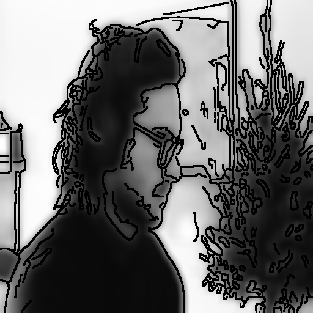
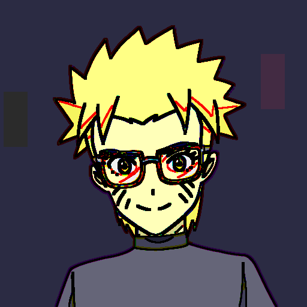
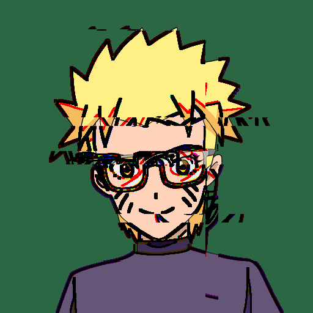
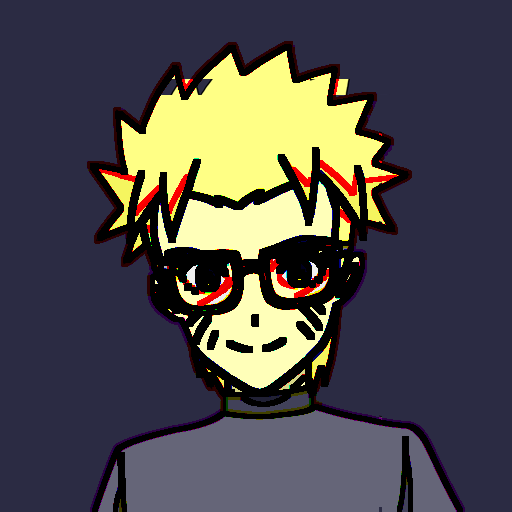

# glitchLoaf
Image and video processing tools for glitch art

Can independently glitch the edges and/or the background.

# NOTE
The artwork used as example input is property of: [Shonen Junk](https://shonenjunk.xyz/).
